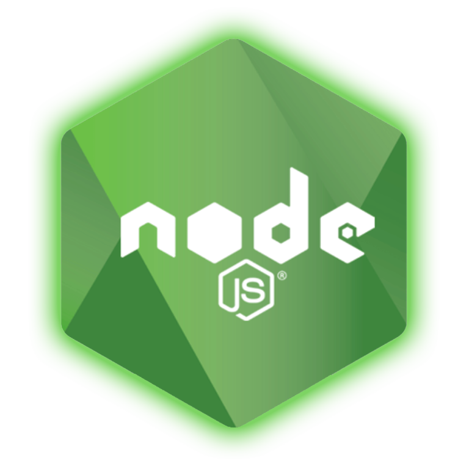

<h1 align="center">A.T.O.M. Games</h1>

<b> Hi all! my name is... actually, it doesn't matter! I is a game developer. </b>

 

<h2>==========>>>>> My skils <<<<<==========</h2>

<table align="center">
	<tr>
		<td rowspan="2">
			
		</td>
		<td align="left"><b><i>C++</i></b></td>
	</tr>
	<tr><td align="left">I'm develop a computer games with help Unreal Engine 5 and SFML-library  
</td></tr>
	<tr>
		<td rowspan="2">
			
		</td>
		<td align="left"><b><i>C#</i></b></td>
	</tr>
	<tr><td align="left">I'm develop a computer games with help Unity 3D and XNA-framework  
</td></tr>
	<tr>
		<td rowspan="2">
			
		</td>
		<td align="left"><b><i>Java</i></b></td>
	</tr>
	<tr><td align="left">I'm nothing write, just included it :)))  
</td></tr>
	<tr>
		<td rowspan="2">
			
		</td>
		<td align="left"><b><i>Node.js</i></b></td>
	</tr>
	<tr><td align="left">I'm write server for client-server app  
</td></tr>
	<tr>
		<td rowspan="2">
			
		</td>
		<td align="left"><b><i>Angular</i></b></td>
	</tr>
	<tr><td align="left">I'm write client for client-server app  
</td></tr>
	<tr>
		<td rowspan="2">
			
		</td>
		<td align="left"><b><i>React.js</i></b></td>
	</tr>
	<tr><td align="left">I'm write client for client-server app  
</td></tr>
	<tr>
		<td rowspan="2">
			
		</td align="left">
		<td align="left"><b><i>PHP</i></b></td>
	</tr>
	<tr><td align="left">I'm write server for client-server app  
</td></tr>
	<tr>
		<td rowspan="2">
			
		</td>
		<td align="left"><b><i>Python</i></b></td>
	</tr>
	<tr><td align="left">I'm write module for neyro-analysis  
</td></tr>
</table>

